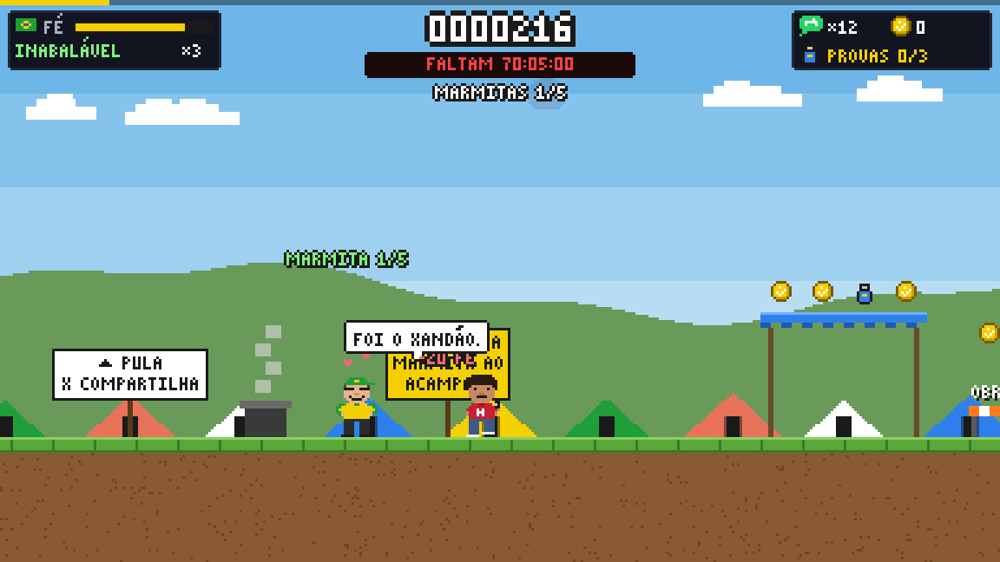
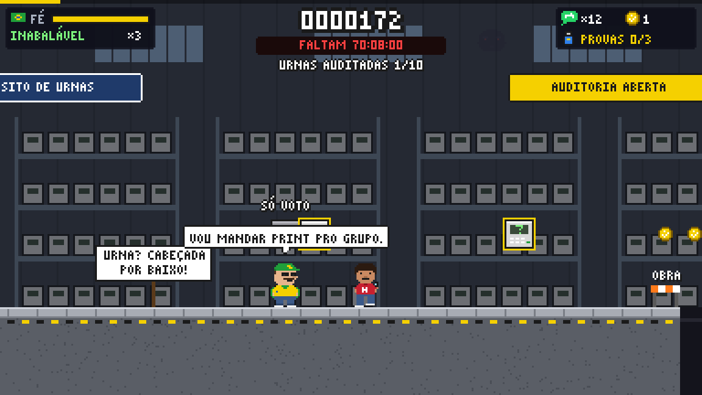
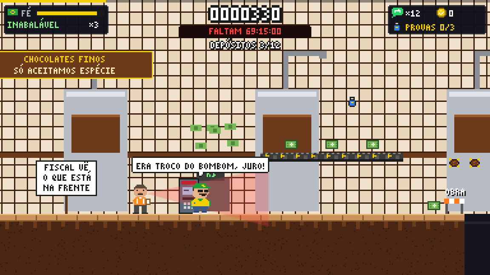

# Rede-Sociais---Analise
## BR-WAR — Operação Liberta o Mito

Jogo de plataforma 2D satírico. Você é o **Patrício**, um patriota de grupo de Zap com uma missão: **soltar o Jair**. Cada fase começa com uma fake news em que ele acredita e termina na **Checagem**, que mostra o fato real com a fonte.

**Estado atual:** 3 de 7 fases jogáveis, ligadas por um **mapa** até Brasília, com efeitos sonoros. As fases são **1. Acampamento do Quartel**, **2. A Urna Fraudada** e **3. A Fábrica de Chocolate**. O progresso fica salvo no aparelho.



### Jogar

```bash
python3 -m http.server 8000   # na raiz do repositório
# abrir http://localhost:8000          → Operação Liberta o Mito
# abrir http://localhost:8000/?jogar   → pula direto para a fase
# abrir http://localhost:8000/?jogar&fase=3 → pula direto para a fase 3 (ou 1, 2)
# abrir http://localhost:8000/classico.html → protótipo antigo (Capitão × L-Livre)
```

| Ação | Teclado | Celular |
|---|---|---|
| Andar / correr (segure 0,6 s) | ← → ou A D | ◀ ▶ |
| Pular (segure para pular mais alto) | Espaço, ↑, W ou Z | PULO |
| Compartilhar corrente de Zap | X ou J | ZAP |
| Descer da lona | ↓ + pular | — |
| Pausar | Esc ou P | II |
| Som liga/desliga | M | — |
| Voltar ao mapa (na pausa) | X | ZAP |
| Painel de depuração | ` (crase) ou `?debug` na URL | — |

### Regras da fase 1

- **Objetivo:** pegar marmitas e entregar 5 aos acampados. Depois, chegar ao portão do quartel, que só abre com todos alimentados.
- **Fé (no lugar de vida):** cai quando você encosta em Militantes e Sindicalistas, e cai mais ainda com o **Checador de Fatos**. Com a Fé zerada, o Patrício "acorda" (game over).
- **Corrente de Zap:** quando converte alguém, ela se multiplica. Depois de um tempo, **volta e acerta quem compartilhou**. O Checador não se converte: ele marca a corrente como "FAKE".
- **Pisar** converte Militantes e Sindicalistas e só atordoa o Checador.
- **Pneu sagrado** é o checkpoint: o Patrício reza e a Fé volta ao máximo.
- **Contador das 72 horas:** quando zera, recomeça.
- **Pendrives:** são as "provas da fraude". Na Checagem, descobre-se que estão vazios.
- Buracos de obra parada custam uma vida (3 no total).

### Fase 2: A Urna Fraudada



- **Fake news:** "A urna é fraudada. O 01 tem as provas."
- **Objetivo:** dar **cabeçada por baixo** em 10 urnas gigantes (as que piscam em amarelo) para "auditar". Todas estão vazias ("0 ERROS", "SÓ VOTO"). Depois, chegar à sala do "código-fonte".
- **Fiscal:** como o Checador, não se converte; pisar nele só o atordoa.
- **Checagem:**
  - relatório das Forças Armadas com 0% de inconsistência;
  - multa de R$ 22,9 milhões ao PL;
  - inelegibilidade de Bolsonaro até 2030 (TSE, jun/2023).
- Fontes:
  - [Diário do Nordeste](https://diariodonordeste.verdesmares.com.br/pontopoder/relatorio-do-ministerio-da-defesa-nao-aponta-fraude-nas-eleicoes-de-2022-1.3299074)
  - [TSE](https://www.tse.jus.br/comunicacao/noticias/2022/Dezembro/tse-confirma-multa-de-r-22-9-milhoes-ao-pl-por-litigancia-de-ma-fe)
  - [Poder360 (inelegibilidade)](https://www.poder360.com.br/justica/tse-forma-maioria-pela-inelegibilidade-de-bolsonaro/)
  - [Poder360 (ação do PL)](https://www.poder360.com.br/eleicoes/moraes-rejeita-pedido-para-invalidar-votos-e-multa-pl-em-r-22-milhoes/)

### Fase 3: A Fábrica de Chocolate



- **Fake news:** "Nunca houve investigação, é invenção da mídia."
- **Objetivo:** recolher notinhas (cabem 5 no bolso) e fazer **12 depósitos** nas caixas de "boca do caixa". Depois, chegar à **mansão**.
- **Fiscal:** tem **campo de visão**. Depositar na frente dele faz perder as notinhas e um pouco de Fé. Pisar nele o deixa atordoado e sem enxergar.
- **Esteiras rolantes:** empurram quem está em cima.
- **Checagem:** separa **ACUSAÇÃO** e **STATUS**.
  - Acusação: denúncia do MP-RJ de 2020.
  - Status: provas anuladas pelo STJ/STF em 2021 e caso arquivado pelo TJ-RJ em 2022, sem condenação; Flávio nega irregularidades.
  - Fato: mansão de ~R$ 6 milhões financiada pelo BRB, com as condições do empréstimo sob apuração da PF; ele nega.
- Fontes:
  - [ConJur](https://conjur.com.br/2020-nov-04/mp-denuncia-flavio-bolsonaro-esquema-rachadinha-alerj/)
  - [CNN Brasil](https://www.cnnbrasil.com.br/politica/stj-anula-decisoes-contra-flavio-bolsonaro-no-caso-das-rachadinhas/)
  - [Agência Brasil](https://agenciabrasil.ebc.com.br/politica/noticia/2022-05/justica-do-rio-arquiva-processo-de-caso-de-supostas-rachadinhas)
  - [Diário de Pernambuco](https://www.diariodepernambuco.com.br/politica/2026/10/11725606-pf-apura-condicoes-de-financiamento-do-brb-a-flavio-bolsonaro-para-mansao-de-rs-6-milhoes.html)

### Fontes da Checagem da fase 1

- [Poder360: acampamentos desfeitos no país](https://www.poder360.com.br/brasil/acampamentos-de-extremistas-de-direita-sao-desfeitos-no-pais/)
- [O Povo: Bolsonaro deixa o Brasil rumo aos EUA (30/12/2022)](https://www.opovo.com.br/noticias/mundo/2022/12/30/amp/bolsonaro-deixa-o-brasil-rumo-aos-eua-as-vesperas-da-posse-de-lula.html)
- [Poder360: STF condenou 835 pelo 8 de Janeiro](https://www.poder360.com.br/poder-justica/depois-de-3-anos-stf-condenou-810-envolvidos-no-8-de-janeiro/)
- [TSE: relatório de transparência eleitoral 2022](https://www.tse.jus.br/eleicoes/eleicoes-2022/arquivos/transparencia-eleitoral-brasil)

Testes das regras (Node 18+): `npm test`. Inclui um robô que conclui as fases 1, 2 e 3 só com as entradas normais.

> Sátira. Feito com auxílio de IA. Personagens são caricaturas; fatos com fonte na tela de Checagem.

### Documentação

- [Conceito atual: Operação Liberta o Mito (v3)](docs/BR-WAR-v3-liberta-o-mito.md)
- [Missão Patriota (v2): arte, HUD e mecânicas](docs/BR-WAR-v2-missao-patriota.md)
- [Especificação técnica original (v1)](docs/BR-WAR-especificacao.md)
- [Pacote de arte](docs/arte/README.md)
