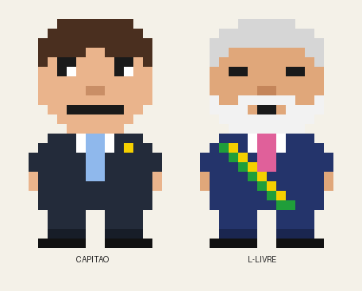

# BR-WAR — Especificação Funcional e Técnica (v0.1)

> Documento de design antes do código. Objetivo: definir regras, mecânicas, experiência, arquitetura e plano de MVP de um jogo de plataforma 2D satírico sobre a política brasileira.
> Status: **proposta para validação**. Cada decisão marcada com 🔶 depende de confirmação.

---

## Sumário

0. [Respostas recomendadas às 5 decisões em aberto](#0-respostas-recomendadas-às-5-decisões-em-aberto)
1. [Avaliação crítica do conceito](#1-avaliação-crítica-do-conceito)
2. [Decisões de game design que ainda precisam ser tomadas](#2-decisões-de-game-design-que-ainda-precisam-ser-tomadas)
3. [Regras completas do jogo](#3-regras-completas-do-jogo)
4. [Comparação e equilíbrio dos personagens](#4-comparação-e-equilíbrio-dos-personagens)
5. [Pontuação, itens e recordes](#5-pontuação-itens-e-recordes)
6. [Humor, mensagens e eventos](#6-humor-mensagens-e-eventos)
7. [Estrutura de fases](#7-estrutura-de-fases)
8. [Arquitetura das telas e UX/UI](#8-arquitetura-das-telas-e-uxui)
9. [Arquitetura de programação e pseudocódigo](#9-arquitetura-de-programação-e-pseudocódigo)
10. [Tecnologia recomendada](#10-tecnologia-recomendada)
11. [Plano de desenvolvimento do MVP](#11-plano-de-desenvolvimento-do-mvp)
12. [Riscos, problemas de jogabilidade e melhorias](#12-riscos-problemas-de-jogabilidade-e-melhorias)
13. [Requisitos funcionais e critérios de aceitação](#13-requisitos-funcionais-e-critérios-de-aceitação)
- [Apêndice A — Direção de arte simplificada (sprites 16×24)](#apêndice-a--direção-de-arte-simplificada-sprites-1624)

---

## 0. Respostas recomendadas às 5 decisões em aberto

| Decisão | Recomendação | Por quê |
|---|---|---|
| **Formato** | **Navegador primeiro** (desktop + celular via controles na tela). Sem loja de apps no MVP. | Um link abre o jogo em qualquer dispositivo. Lojas (Google Play/App Store) têm políticas restritivas para conteúdo político e exigem revisão. |
| **Estilo visual** | **Pixel art simples, estilo "cabeção"** (sprites 16×24 px, escala inteira). Ver [Apêndice A](#apêndice-a--direção-de-arte-simplificada-sprites-1624). | As referências enviadas são ótimas como conceito, mas são detalhadas demais para animar à mão (cada pose exige redesenho). Sprites pequenos permitem desenhar os quadros no próprio código, iterar rápido e manter a estética de caricatura, não de retrato. |
| **Modo de jogo** | **Mesmas fases para os dois**, com diferenças por personagem em: itens, especial, inimigos "convertíveis", mensagens, atalhos opcionais e chefe final (o rival). | Duas campanhas dobram o trabalho de level design. Fases compartilhadas com variações em dados dão a sensação de experiências diferentes por ~10% do custo. |
| **Persistência** | **Recordes locais** (no dispositivo) no MVP. Ranking online só na fase 2, e apenas com validação no servidor. | Ranking online sem validação é manipulado em horas. Recorde local já entrega o loop "tentar de novo para bater a marca". |
| **Tom político** | **Arquétipos caricatos com apelidos fictícios** ("Capitão", "L-Livre"), referências a **frases e fatos públicos**, sem nomes reais nos textos do jogo, sem acusações de crimes e com **os dois lados satirizados com a mesma intensidade**. | Reduz riscos jurídicos (direito de imagem, honra) e mantém o humor reconhecível. Sátira equilibrada envelhece melhor e amplia o público. |

---

## 1. Avaliação crítica do conceito

### Pontos fortes
- **Gancho claro**: "corrida até o Planalto" é um objetivo que qualquer brasileiro entende sem tutorial.
- **Plataforma 2D é um gênero conhecido**: o jogador já sabe correr, pular e atirar. O esforço pode ir para o humor e o design das fases.
- **Itens temáticos** (carteira de trabalho, picanha, coração) já são piadas visuais: o projétil conta a piada sozinho.
- **Dois personagens rivais** permitem um final espelhado (cada um enfrenta o outro) com custo baixo.

### Problemas encontrados e alternativas

| # | Problema | Por que é um problema | Alternativa recomendada |
|---|---|---|---|
| P1 | **A descrição do L-Livre é contraditória.** O texto fala em "liberdade econômica e conservadorismo", mas os itens (picanha, coração/"o amor venceu") remetem ao campo político oposto, e os alvos são "o conservadorismo e a família brasileira". | Se a identidade do personagem não bate com os itens, a piada perde o sentido e os dois personagens viram a mesma coisa. | **Capitão** = sátira do discurso patriótico-militar-conservador. **L-Livre** = sátira do discurso popular-sindical-de-consumo ("picanha", "amor", "companheiro"). Cada um enfrenta caricaturas do campo oposto e **ambos** enfrentam inimigos neutros (burocracia, Centrão, fake news, fila). |
| P2 | **Arremessar Bíblias em personagens.** | O art. 208 do Código Penal tipifica "vilipendiar publicamente ato ou objeto de culto religioso". Mesmo sem processo, isso gera denúncias, remoção de hospedagem e desvia a crítica do político para a religião do público. | A Bíblia vira o **especial "Deus acima de todos"**: o personagem a ergue e ganha um escudo de luz com invencibilidade curta. A piada continua (o uso político do discurso religioso) sem que o livro seja usado como arma. |
| P3 | **"Alvos que representam a família brasileira".** | Atacar um grupo social, e não um discurso, deixa de ser sátira política e vira deboche de pessoas comuns. | Os alvos são **arquétipos de discurso**, presentes nos dois lados: "Tio do Zap", "Militante de Rede", "Coach do Empreendedorismo", "Sindicalista de Palanque", "Patriota do Caminhão", "Influencer Lacrador". |
| P4 | **Itens como armas literais** (matar pessoas com picanha). | Fica repetitivo e reforça a ideia de violência política. | Itens **"convencem"**: o inimigo atingido não morre, é **convertido**. Ele vira apoiador, dança e sai da tela, ou vira uma plataforma temporária. É mais engraçado, mais coerente com o tema (disputar votos) e cria uma mecânica nova (ver §5.1). |
| P5 | **Escopo amplo** (fases, ranking, conquistas, eventos, balões, várias poses). | Projetos solo morrem por escopo. | MVP = **1 fase completa + 2 personagens + 1 item e 1 especial por personagem + recorde local**. O restante entra em etapas (§11). |
| P6 | **Pulo duplo + corrida + arremesso + especial** ao mesmo tempo. | Muitos botões no celular. | **Sem pulo duplo no MVP.** O pulo usa altura variável, "coyote time" e buffer de pulo, o que já resolve a precisão. A corrida é automática (acelera segurando a direção). Botões: ← → Pular, Arremessar, Especial. |
| P7 | **Personagens baseados em pessoas reais** com semelhança fotográfica. | Direito de imagem e risco de ser lido como propaganda eleitoral em período de campanha (Lei 9.504/97). | Caricatura estilizada em pixel art, apelidos fictícios e aviso de sátira na tela inicial. Evitar publicar ou impulsionar durante o período eleitoral oficial e nunca pedir voto. |

> ⚠️ Isto não é aconselhamento jurídico. Antes de divulgar amplamente, vale uma consulta rápida a um advogado de direito digital/eleitoral.

---

## 2. Decisões de game design que ainda precisam ser tomadas

| ID | Decisão | Opções | Recomendação 🔶 |
|---|---|---|---|
| D1 | Nomes finais | "Capitão" / "L-Livre" ou alternativos ("Mito Man", "Companheiro") | Manter os nomes atuais |
| D2 | O que acontece no game over | Reiniciar a fase ou reiniciar o jogo | Reiniciar **a fase atual** com a pontuação zerada para aquela fase |
| D3 | Quantidade de fases na versão 1.0 | 3 / 6 / 10 | **6** (ver §7) |
| D4 | O chefe final é o rival? | Sim / chefe neutro ("O Centrão") | **Sim, o rival.** Chefe neutro como opcional ou para um modo futuro |
| D5 | Ranking online | Sim / Não | **Não no MVP** |
| D6 | Trilha sonora | Chiptune original / domínio público | Chiptune simples (jsfxr para efeitos e uma música curta em loop) |
| D7 | Idioma | Só PT-BR / PT + EN | **Só PT-BR**: o humor é local |
| D8 | Classificação indicativa | Livre / 10 / 12 anos | Mirar **12 anos** (sátira política, sem violência gráfica) |

---

## 3. Regras completas do jogo

Unidades: **1 tile = 16 px**. Resolução lógica: **384×216** (24×13,5 tiles, 16:9), ampliada em escala inteira (×2, ×3, ×4…). Simulação a **60 passos por segundo** com passo fixo.

### 3.1 Movimentação lateral
- **Funcionamento:** segurar ← ou → acelera até a velocidade máxima do personagem. Ao soltar, desacelera por atrito.
- **Regras:** aceleração no chão de 1.800 px/s²; no ar, 60% disso (controle aéreo reduzido, mas presente). Ao inverter a direção, aplica o dobro da desaceleração ("virada rápida").
- **Corrida:** sem botão. Após **0,6 s** segurando a mesma direção no chão, a velocidade máxima sobe para o valor de corrida. Parar ou trocar de direção cancela a corrida.
- **Exceções:** durante o knockback (0,25 s) a entrada de direção é ignorada. Encostar numa parede zera a velocidade horizontal.
- **Implementação:** `vx = approach(vx, alvo, aceleração * dt)`, em que `alvo = direção * (correndo ? vCorrida : vAndar)`.

### 3.2 Pulo
- **Funcionamento:** pressionar Pular aplica a velocidade vertical inicial `-vPulo`.
- **Altura variável:** soltar o botão enquanto o personagem ainda sobe multiplica `vy` por 0,45 (pulo curto).
- **Coyote time:** ainda é possível pular até **0,1 s** depois de sair de uma borda.
- **Buffer de pulo:** um toque até **0,12 s antes** de tocar o chão fica guardado e é executado ao aterrissar.
- **Pulo duplo:** ❌ fora do MVP. Pode virar item temporário ("Emenda de Última Hora") na fase 2.
- **Gravidade:** 1.400 px/s² subindo e 2.100 px/s² caindo (a queda mais rápida dá sensação de peso). Velocidade de queda limitada a 520 px/s.
- **Pular sobre inimigos:** cair sobre um inimigo "pisável" o converte (+100 pontos) e gera um quique de `-0,7 * vPulo`.

### 3.3 Arremesso de itens
- **Funcionamento:** o botão Arremessar lança o item principal do personagem na direção em que ele está virado.
- **Condições:** munição > 0, cooldown zerado e no máximo **3 projéteis** do jogador na tela.
- **Trajetória:** definida pelo item (reta ou arco, ver §4).
- **Fim do projétil:** some ao atingir um inimigo, um bloco sólido, sair da câmera ou após 1,5 s.
- **Munição:** coletada em caixas temáticas. **Munição nunca chega a zero de forma permanente:** se o jogador ficar 8 s sem munição, aparece uma caixa perto do último checkpoint (evita travar o jogo).
- **Implementação:** uma lista (pool) de projéteis pré-criados é reutilizada, sem criar objetos durante o jogo.

### 3.4 Especial (1 por personagem)
- Carregado pela **barra de Engajamento** (0 a 100%), que enche ao converter inimigos (+20%) e coletar bônus (+10%).
- Com a barra cheia, o botão Especial ativa a habilidade e esvazia a barra.
- Detalhes de cada especial em §4.

### 3.5 Colisões
- **Jogador × cenário (tiles sólidos):** AABB resolvida por eixo (move X → resolve → move Y → resolve).
- **Plataformas "de nuvem" (one-way):** sólidas só por cima e só quando `vy ≥ 0`. Segurar ↓ + Pular atravessa.
- **Jogador × inimigo:** se o jogador está caindo e o pé está acima da metade do inimigo → pisão. Caso contrário → dano.
- **Projétil × inimigo:** sobreposição AABB → converte (ou dano no chefe).
- **Jogador × coletável:** sobreposição → coleta.
- **Jogador × perigo** (espinhos, buraco): dano ou morte (ver §3.6).

### 3.6 Dano, energia e vidas
Nomenclatura temática:
- **Aprovação** = energia (corações): Capitão 3, L-Livre 4 (ver equilíbrio em §4).
- **Candidaturas** = vidas. Começa com 3. Máximo de 9.

Regras:
1. Dano de contato ou de projétil inimigo = −1 de Aprovação, seguido de **1,5 s de invencibilidade** (personagem pisca) e knockback.
2. Cair em um buraco = perde **uma Candidatura** inteira, independentemente da Aprovação.
3. Aprovação chega a 0 → perde uma Candidatura.
4. Ao perder uma Candidatura: o personagem reaparece no **último checkpoint** com Aprovação cheia, mantendo pontos e munição coletada. O combo zera.
5. Candidaturas chegam a 0 → **Game Over**.
6. Recuperação: o item "Pastel de Feira" devolve +1 de Aprovação. Uma "Candidatura extra" (raríssima, 1 por fase) dá +1 vida.

### 3.7 Coletáveis e bônus

| Item | Efeito | Pontos |
|---|---|---|
| **Voto** (moeda) | +1 voto; 100 votos = +1 Candidatura | 10 |
| **Caixa de munição** | +5 do item do personagem | 0 |
| **Pastel de Feira** | +1 Aprovação | 50 |
| **Santinho dourado** (3 por fase, escondidos) | Coleção / conquista | 500 |
| **Hashtag em Alta** | Engajamento +30% | 100 |

### 3.8 Checkpoints
- Bandeira "**Urna de Checkpoint**". Ao tocar, ativa (animação + mensagem) e salva a posição de reaparecimento.
- Só a mais recente vale. Não dá para voltar a um checkpoint anterior.
- 2 a 3 por fase, espaçados em ~60–90 s de jogo.
- **Exceção:** checkpoints não restauram inimigos já convertidos (evita farm de pontos).

### 3.9 Plataformas móveis e obstáculos dinâmicos

| Elemento | Comportamento | Tema |
|---|---|---|
| **Plataforma em vaivém** | Move entre dois pontos (A↔B) com velocidade constante e carrega o jogador | "Mesa de negociação" |
| **Plataforma que cai** | Treme 0,5 s após ser pisada, cai e reaparece em 3 s | "Promessa de campanha" |
| **Bloco que some** | Alterna sólido/fantasma num ciclo de 2 s | "Fake news" (some quando checada) |
| **Carimbo gigante** | Esmaga em ciclo; dano ao tocar a face de baixo | Burocracia |
| **Fila do INSS** | Bloco de NPCs que só abre quando um projétil acerta o "Atendente" | Burocracia |

Implementação: todas as plataformas móveis guardam `deltaX/deltaY` do quadro. O jogador apoiado sobre elas soma esse deslocamento antes da própria física.

### 3.10 Inimigos (comportamentos-base reutilizáveis)

Todo inimigo é a combinação de **1 comportamento de movimento + 1 tema visual + regras de conversão**. Isso permite criar dezenas de inimigos com só 5 comportamentos.

| Comportamento | Descrição | Exemplos temáticos |
|---|---|---|
| `patrol` | Anda até a borda ou parede e vira | Tio do Zap, Militante de Rede |
| `chase` | Persegue o jogador quando ele está a menos de 6 tiles na horizontal; para na borda | Patriota do Caminhão, Sindicalista |
| `shooter` | Parado; dispara um projétil a cada 2,5 s quando o jogador está na mira | Influencer (dispara "Textão"), Coach (dispara "Curso Grátis") |
| `jumper` | Pula em ciclo vertical | Repórter de Plantão |
| `bribable` (neutro) | Bloqueia o caminho. **Não é convertido por dano:** recebe 3 itens de qualquer tipo e passa a ajudar por 10 s (vira plataforma ou empurra inimigos) | **Centrão** |

**Afinidade (mecânica de identidade):** cada inimigo tem uma lista de itens a que é **sensível** (converte com 1 acerto) e **resistente** (precisa de 2). Exemplo: o "Sindicalista de Palanque" é sensível à picanha e resistente à carteira de trabalho. O "Tio do Zap" é o contrário. Assim, a escolha do personagem muda a dificuldade de trechos específicos (mas sempre de forma possível, ver §4.4).

### 3.11 Condições de derrota e reinício
- **Derrota da fase:** Candidaturas = 0 → Game Over → opções "Tentar de novo" (reinicia a fase), "Trocar personagem" e "Menu".
- **Reinício rápido:** tecla R (ou botão na pausa) reinicia do último checkpoint ao custo de 1 Candidatura.
- **Tempo:** sem limite de tempo que mate o jogador. O tempo só influencia o bônus de pontuação (a frustração com cronômetro é desproporcional ao ganho).

### 3.12 Conclusão da fase
- Tocar a **Faixa de Chegada** (fases 1 a 5) ou derrotar o chefe (fase 6).
- Ao concluir: o jogo congela, contabiliza os pontos (§5), salva o progresso e libera a próxima fase.

### 3.13 Dificuldade progressiva
Ver §7.3. Princípio: **introduzir → praticar com segurança → combinar → testar.** Cada fase introduz no máximo 1 mecânica nova.

---

## 4. Comparação e equilíbrio dos personagens

### 4.1 Ficha

| Atributo | **Capitão** | **L-Livre** |
|---|---|---|
| Fantasia | Rápido, agressivo, "linha reta" | Resistente, carismático, "ataque por cima" |
| Velocidade (andar / correr) | 120 / 190 px/s | 105 / 165 px/s |
| Altura de pulo | 3,5 tiles (56 px) | 4,25 tiles (68 px) |
| Aprovação (energia) | 3 | 4 |
| **Item principal** | **Carteira de Trabalho Verde-Amarela** — trajetória reta e rápida (360 px/s), cooldown 0,35 s, munição inicial 10 | **Picanha** — arco parabólico (lançada a 45°), atinge inimigos em plataformas acima e abaixo, cooldown 0,5 s, munição inicial 6 |
| Afinidade do item | Converte com 1 acerto: Sindicalista, Militante de Rede, Influencer Lacrador | Converte com 1 acerto: Tio do Zap, Patriota do Caminhão, Coach |
| **Especial** | **"Deus acima de todos"**: ergue a Bíblia, ganha 4 s de invencibilidade + 30% de velocidade, e converte inimigos ao encostar | **"O amor venceu"**: lança uma onda de corações que converte **todos os inimigos comuns na tela** (o chefe sofre 1 de dano) |
| Ponto fraco | Pouca Aprovação; pulo baixo; o projétil reto não atinge alvos acima | Mais lento; munição curta; o arco erra alvos muito próximos |
| Atalhos exclusivos | Trechos de **corrida contra o tempo** (portões que fecham) | Trechos de **plataformas altas** (atalhos verticais) |

### 4.2 Por que a escolha muda a experiência
- **Capitão** joga "de frente": corre, atira reto, usa o especial como avanço invencível. Recompensa reflexo.
- **L-Livre** joga "por cima": pula alto, atira em arco por cima de obstáculos, usa o especial para limpar a tela. Recompensa posicionamento.
- O mesmo trecho da fase muda de dificuldade por causa da afinidade dos inimigos e das rotas opcionais.

### 4.3 Como evitar que um seja muito mais forte
1. **Orçamento de poder.** Cada atributo vale pontos numa planilha (ex.: +1 de Aprovação = 10 pts; +10% de velocidade = 8 pts; ...). Os dois personagens devem ficar a no máximo ±5% um do outro.
2. **Rota principal comum.** O caminho obrigatório de cada fase é desenhado para o **menor pulo** (3,5 tiles) e é **completável sem atirar** (todo inimigo do caminho crítico pode ser pisado ou evitado). As vantagens exclusivas ficam só em rotas opcionais e bônus.
3. **Métricas de teste.** Para cada fase, registrar tempo médio de conclusão, mortes por tentativa e pontuação média de cada personagem. Meta: diferença < 15%. Se passar disso, ajustar números no arquivo de dados (nunca no código).
4. **Especiais com o mesmo custo** (barra cheia) e efeitos de valor equivalente: um é defensivo/mobilidade, o outro é ofensivo/limpeza.

### 4.4 Seleção de personagens (lógica)
- **Ambos disponíveis desde o início.** Bloquear metade do conteúdo jogável num jogo curto frustra mais do que motiva. O desbloqueável é cosmético (ex.: "versão faixa presidencial" após zerar).
- **Apresentação:** dois cartões lado a lado, cada um com sprite animado (idle), nome, frase de efeito, 4 barras de atributo (Velocidade, Pulo, Resistência, Munição), ícones do item e do especial.
- **Navegação:** ←/→ alterna o cartão em foco; Enter/toque confirma. No celular, tocar no cartão foca e tocar em "Confirmar" seleciona.
- **Persistência:** `GameSession.characterId` fica em memória durante a partida e `save.lastCharacterId` no armazenamento local (para pré-selecionar na próxima vez). Recordes são guardados **por personagem**.
- **Fluxo:** a escolha é passada para `LevelScene` via `{ characterId, levelId }`. A cena lê a definição em `data/characters.json`. Trocar de personagem só é possível pelo menu ou pelo Game Over.

---

## 5. Pontuação, itens e recordes

### 5.1 Recomendação sobre o papel dos itens
Avaliadas as 4 opções (ataque, distração, pontos, desbloqueio), a mais divertida é a **combinação com um único verbo: "convencer"**.

| Papel | Como aparece | Por que funciona |
|---|---|---|
| **Ataque** (principal) | O projétil **converte** o inimigo: ele faz uma dancinha com balão ("Me convenceu!") e sai da tela | Feedback claro e engraçado, sem violência |
| **Pontos** | Conversão = pontos + Engajamento + combo | Recompensa a precisão |
| **Desbloqueio** | Alguns obstáculos exigem um acerto: o "Atendente" abre a fila, o "Centrão" exige 3 itens | Dá ao item um uso de puzzle leve |
| **Distração** | ❌ Fora do MVP | Exige IA mais complexa (inimigos indo atrás do item) com pouco ganho |

### 5.2 Tabela de pontos

| Evento | Pontos base | Observação |
|---|---|---|
| Voto coletado | 10 | |
| Avanço no cenário | 1 por tile da **maior distância já alcançada** | Andar para trás e para frente não pontua |
| Converter inimigo (projétil) | 100 | ×combo |
| Converter inimigo (pisão) | 150 | ×combo (mais arriscado, vale mais) |
| Converter o Centrão | 300 | |
| Superar um obstáculo-chave (atravessar um trecho marcado no mapa) | 200 | Uma vez por trecho |
| Checkpoint ativado | 250 | Uma vez |
| Santinho dourado | 500 | |
| Concluir a fase | 2.000 | |
| Bônus de tempo | `max(0, (tempoAlvo − tempo) * 20)` | Limitado a 3.000 |
| Bônus "Ficha Limpa" (sem levar dano) | 1.500 | |
| Bônus "Unanimidade" (todos os inimigos convertidos) | 1.000 | |

### 5.3 Combo e multiplicador
- Cada conversão em até **3 s** da anterior aumenta o combo.
- Multiplicador: combo 0–2 → ×1; 3–5 → ×2; 6–9 → ×3; 10+ → ×4 (**teto ×4**).
- Levar dano ou ficar 3 s sem converter → combo volta a 0.
- **Penalidades:** não se subtraem pontos (perder pontos desmotiva). A punição é perder o combo, a Aprovação e o bônus "Ficha Limpa".

### 5.4 Prevenção de pontuação abusiva
1. Inimigos **não reaparecem** (nem ao morrer, nem no checkpoint).
2. A distância conta só para **novo máximo** de X.
3. Cada coletável e cada trecho de obstáculo tem um ID único e só pontua uma vez por partida.
4. Multiplicador com teto. Bônus de tempo com teto.
5. **Pontuação teórica máxima por fase** calculada a partir do mapa (soma de todos os eventos possíveis com ×4). Pontuação acima disso = inválida (útil para o ranking online).

### 5.5 Conquistas (fase 2)
Exemplos: "Ficha Limpa" (zerar uma fase sem dano), "Base Aliada" (converter 50 inimigos), "Arrecadação Recorde" (300 votos numa fase), "Toma lá, dá cá" (converter o Centrão 5 vezes), "Ambidestro" (zerar com os dois personagens), "Quebra de Decoro" (morrer 10 vezes na mesma fase — conquista de consolo).

### 5.6 Recordes
- **Local (MVP):** `localStorage` com chave versionada `brwar.save.v1`:
  ```json
  {
    "version": 1,
    "lastCharacterId": "capitao",
    "unlockedLevels": ["fase1"],
    "settings": { "music": 0.7, "sfx": 0.8, "screenShake": true, "textSpeed": "normal" },
    "records": {
      "capitao": { "fase1": { "score": 18450, "time": 142.3, "date": "2026-10-08" } },
      "llivre":  {}
    },
    "topScores": [ { "nick": "TIO", "characterId": "llivre", "score": 52000, "date": "2026-10-08" } ],
    "achievements": []
  }
  ```
  - Top 10 local com apelido de até 3–10 caracteres (estilo fliperama).
  - Leituras e escritas protegidas com try/catch; se o armazenamento estiver indisponível (aba anônima), o jogo funciona sem salvar e avisa uma vez.
  - Migração: se `version` for antiga, uma função `migrate(save)` converte para o formato atual.

- **Ranking online (fase 3, opcional):** tabela `scores(id, nick, character_id, level_id, score, duration_ms, created_at, run_hash)`.
  Mitigação de fraude (impossível eliminar 100% num jogo que roda no navegador):
  1. Escrita só por uma **função no servidor** (ex.: Supabase Edge Function), nunca direto do cliente na tabela.
  2. O servidor emite um **token de partida** (`runId` + horário de início). O envio só é aceito com token válido, de uso único.
  3. Validação de **plausibilidade**: duração ≥ tempo mínimo humano da fase; pontuação ≤ máximo teórico (§5.4); taxa de pontos por segundo dentro do limite.
  4. O cliente envia o **log de eventos** compacto (tipo + quadro). O servidor recalcula a pontuação com o mesmo módulo de regras (código compartilhado) e compara.
  5. Limite de envios por IP/dispositivo; filtro de palavrões no apelido; moderação manual de outliers.

### 5.7 Apresentação dos resultados (tela de conclusão)
Contagem animada, linha por linha (0,3 s cada, pulável com qualquer tecla):
```
Votos ............... 1.230
Conversões .......... 4.800
Combos .............. 2.100
Fase concluída ...... 2.000
Bônus de tempo ...... 1.140
Ficha Limpa ......... 1.500
─────────────────────────────
TOTAL .............. 12.770   ★ NOVO RECORDE!
```
Seguida de uma **manchete satírica** baseada no desempenho (§6).

---

## 6. Humor, mensagens e eventos

### 6.1 Formatos de exibição

| Formato | Uso | Duração | Regra de legibilidade |
|---|---|---|---|
| **Texto flutuante** | Pontos e reações curtas sobre o alvo ("+100 CONVERTIDO!") | 0,8 s, sobe 16 px e some | ≤ 3 palavras |
| **Balão de fala** | Frases do personagem ou do NPC | 2 s | ≤ 60 caracteres, 1 balão por vez |
| **Faixa de manchete** (topo da tela, estilo "plantão") | Checkpoint, evento especial, recorde | 2,5 s | ≤ 70 caracteres; não cobre a área de jogo central |
| **Manchete de jornal** (tela cheia) | Conclusão de fase e Game Over | Até o jogador avançar | Sem limite rígido |

### 6.2 Sistema de mensagens (regras)
- Mensagens ficam em **`data/messages.json`**, nunca no código.
- Cada mensagem tem: `id`, `event`, `character` (`capitao`, `llivre` ou `any`), `text`, `weight`, `rarity` (`common` | `rare` | `legendary`), `tag` (`piada` | `fato` | `bordao`) e, se for fato, `source`.
- **Sem repetição excessiva:** "saco embaralhado" (shuffle bag) por evento. Todas as frases de um evento saem uma vez antes de repetir; ao reembaralhar, a última frase não pode ser a primeira.
- **Cooldown global:** no máximo 1 balão a cada 4 s, para não poluir a tela. Eventos de alta prioridade (checkpoint, recorde) furam a fila.
- **Raras:** 5% de chance (`rare`) e 0,5% (`legendary`, easter eggs).
- **Atualizar frases:** editar o JSON e recarregar. Nenhuma linha de lógica muda. Um script de validação (fase 2) verifica campos obrigatórios e tamanho máximo.

Exemplo de entrada:
```json
{ "id": "cp_llivre_03", "event": "checkpoint", "character": "llivre",
  "text": "Checkpoint! Agora é só esperar a picanha chegar.",
  "weight": 1, "rarity": "common", "tag": "bordao",
  "source": "Promessa de campanha de 2022 ('picanha e cervejinha'), amplamente noticiada" }
```

### 6.3 Fatos × piadas
- **Fato verificável** (`tag: "fato"`): referência a algo público e documentado (uma frase dita em público, um programa de governo, um slogan). Exige o campo `source` preenchido e **revisado antes de publicar**.
- **Bordão** (`tag: "bordao"`): brincadeira com uma frase pública conhecida, sem afirmar fatos novos.
- **Piada** (`tag: "piada"`): ficção explícita. Nunca afirmar como verdade algo inventado sobre uma pessoa real (crime, doença, vida privada).
- A tela "Sobre" informa: *"BR-WAR é uma obra de ficção satírica. Personagens são caricaturas de discursos políticos. Frases marcadas como referência a fatos públicos têm fonte indicada."*

### 6.4 Banco inicial de frases (exemplos)

**Ao coletar um item**
- (any) "Mais um voto! Esse não foi comprado. Acho."
- (any, Pastel) "Pastel de feira: o verdadeiro programa de governo."
- (Capitão, munição) "Carteira verde e amarela! Agora com menos direitos e mais cor." *(bordão: referência ao programa "Carteira Verde e Amarela", MP 905/2019)*
- (L-Livre, munição) "Picanha chegou! Pelo menos aqui a promessa foi cumprida." *(bordão)*

**Ao acertar/converter um alvo**
- (any) "CONVERTIDO!" · "Mudou de lado!" · "Virou base aliada!"
- (Capitão) "Mais um que largou o sindicato." · "Talkey?"
- (L-Livre) "Companheiro novo na área!" · "Caiu no churrasco, virou militante."
- (NPC convertido, raro) "Eu só vim pelo lanche, mas fico."

**Ao perder Aprovação/vida**
- (any) "Sua aprovação despencou. Culpe a gestão anterior."
- (any) "Isso foi um ataque da imprensa!"
- (Capitão) "Foi fake news, tá ok?"
- (L-Livre) "Nunca antes na história deste país alguém caiu tanto."

**Ao passar por um obstáculo**
- (any, carimbo) "Sobreviveu à burocracia. Falta só reconhecer firma."
- (any, plataforma que cai) "Promessa de campanha: não pise duas vezes."
- (any, fake news) "Checou a fonte? Então o bloco sumiu."

**Ao alcançar um checkpoint**
- (any) "Checkpoint! Seu progresso foi salvo, ao contrário do orçamento."
- (any) "Urna apurada: você continua no páreo."
- (Capitão) "Checkpoint! Missão dada é missão cumprida."
- (L-Livre) "Checkpoint! Vamos fazer uma pausa para o cafezinho."

**Ao concluir a fase (manchetes)**
- "CANDIDATO AVANÇA E PROMETE CONCLUIR AS OBRAS DA FASE ANTERIOR"
- "PESQUISA: 98% DOS CONVERTIDOS NÃO LEMBRAM EM QUEM VOTARAM"
- (pontuação baixa) "VITÓRIA APERTADA: ADVERSÁRIOS PEDEM RECONTAGEM"
- (Ficha Limpa) "FATO INÉDITO: CANDIDATO TERMINA FASE SEM NENHUM ARRANHÃO"

**Sequência de erros (3 mortes no mesmo trecho)**
- "Talvez seja hora de mudar de estratégia. Ou de partido."
- "Seu marqueteiro pediu demissão."
- "Dica: pular costuma funcionar melhor que discursar."

**Novo recorde**
- "RECORDE HISTÓRICO! Só falta o Congresso aprovar."
- "Maior pontuação desde a redemocratização (desta máquina)."

**Eventos inesperados (faixa de plantão)**
- "URGENTE: CPI instaurada! Inimigos ganham velocidade por 10 s."
- "PLANTÃO: Horário eleitoral gratuito! Tudo pausa por 3 s." *(evento cômico: a tela congela com um "comercial" e volta)*
- "BREAKING: O Centrão mudou de lado. De novo."
- "ATENÇÃO: Feriado prolongado! Os burocratas foram embora mais cedo." *(remove inimigos de burocracia do trecho)*

**Easter eggs (lendários)**
- Pular 50 vezes parado: "Está fazendo campanha de ginástica laboral?"
- Ficar 60 s parado: "Candidato em silêncio. Assessoria orienta não dar entrevistas."
- Converter o Centrão 3 vezes na mesma fase: "O Centrão agradece a preferência. Volte sempre."

### 6.5 Eventos aleatórios
- Gatilho: trechos marcados no mapa como `eventZone`. Ao entrar, 35% de chance de sortear um evento da lista da fase. **Máximo de 1 evento por zona e 3 por fase**.
- Eventos nunca matam diretamente nem bloqueiam o caminho de forma permanente. Duram no máximo 10 s.
- Definidos em `data/events.json` (id, texto da manchete, duração, modificadores: `enemySpeedMul`, `freezeSeconds`, `removeEnemyTag`...).

---

## 7. Estrutura de fases

### 7.1 Visão geral (6 fases até Brasília)

| # | Nome | Cenário | Mecânica nova | Dificuldade |
|---|---|---|---|---|
| 1 | **Comício no Bairro** | Rua de periferia, feira, bar, carro de som | Movimento, pulo, arremesso, pisão (tutorial embutido) | ★☆☆☆☆ |
| 2 | **Domingo na Avenida** | Avenida tomada por duas manifestações, trio elétrico, bandeiras | Plataformas móveis (trios) e inimigos `chase` | ★★☆☆☆ |
| 3 | **Labirinto da Repartição** | Prédio público: filas, pastas, carimbos, elevador quebrado | Carimbos esmagadores, fila do INSS (puzzle de acerto), plataformas que caem | ★★★☆☆ |
| 4 | **Grupo da Família** | Interior de um celular: balões de chat, figurinhas, notificações | Blocos de fake news (aparecem/somem), inimigos `shooter` (textões) | ★★★☆☆ |
| 5 | **Votação no Plenário** | Congresso: mesas, microfones, painel de votação | Centrão (`bribable`), plataformas sobre um "painel" que muda conforme os votos | ★★★★☆ |
| 6 | **Rampa do Planalto** | Praça dos Três Poderes ao entardecer | **Chefe: o rival** (debate final) | ★★★★☆ |

### 7.2 Detalhamento

**Fase 1 — Comício no Bairro (MVP)**
- **Objetivo:** chegar ao palanque no fim da rua.
- **Visual:** céu azul, casas coloridas, varais, barraca de pastel, carro de som; paleta quente.
- **Obstáculos:** buracos na rua ("obra parada" com placa), caixotes, plataformas de toldo (one-way), 1 plataforma que cai.
- **Inimigos:** Tio do Zap (`patrol`), Militante de Rede (`patrol`), Sindicalista (`patrol`, sensível à picanha), 1 Patriota do Caminhão (`chase`, no fim).
- **Itens:** votos, 3 caixas de munição, 1 pastel, 3 santinhos dourados.
- **Eventos:** "Carro de som passa": o volume sobe e os inimigos ficam atordoados por 2 s.
- **Tutorial embutido:** placas de "propaganda eleitoral" ensinam os controles ("APERTE ↑ PARA PULAR — ou para subir nas pesquisas").
- **Conclusão:** tocar o palanque. **Recompensa:** libera a fase 2 e a manchete final.
- **Tamanho:** ~200 tiles de largura, 2 checkpoints, 90–150 s para um jogador médio.

**Fase 2 — Domingo na Avenida**
- Duas multidões em lados opostos da avenida. Trios elétricos são plataformas móveis.
- Inimigos `chase` dos dois "lados", com afinidades opostas.
- Evento: "Chuva!": as bandeiras viram plataformas escorregadias por 8 s.

**Fase 3 — Labirinto da Repartição**
- Fase com mais verticalidade e ritmo de puzzle: o caminho principal passa por filas que exigem acertar o "Atendente".
- Carimbos gigantes em sequência (timing). Plataformas de pastas que caem.
- Evento: "Sistema fora do ar": luzes apagam, só o personagem e os perigos ficam visíveis por 5 s.

**Fase 4 — Grupo da Família**
- Visual de interface de mensageiro. Plataformas são balões de chat que surgem em sequência.
- Blocos "FAKE" alternam sólido/fantasma. Inimigos `shooter` disparam "textões" (projéteis lentos e grandes).
- Evento: "Áudio de 7 minutos": um balão gigante atravessa a tela devagar e serve de plataforma.

**Fase 5 — Votação no Plenário**
- O **Centrão** bloqueia passagens. É preciso "investir" 3 itens nele para ele virar plataforma ou abrir caminho.
- Painel de votação: barras que sobem/descem como plataformas de acordo com conversões feitas na sala.
- Evento: "Pedido de vista": todas as plataformas param por 4 s.

**Fase 6 — Rampa do Planalto (chefe)**
- Arena fechada com a rampa ao fundo.
- **Chefe = personagem rival**, controlado pela IA, com 3 fases de vida (6 acertos cada):
  1. Anda e arremessa o próprio item no padrão do personagem dele.
  2. Usa o especial dele (avanço invencível ou onda de corações, que o jogador precisa pular).
  3. Chama 2 inimigos de apoio e fica mais rápido.
- Fraqueza: fica 1,5 s "dando entrevista" (vulnerável) depois de cada ataque.
- **Final satírico (igual para os dois):** o vencedor sobe a rampa, recebe a faixa e aparece a manchete: *"ELEITO! Agora começa a parte difícil: negociar com o Centrão."* Créditos com "Fase bônus: Governar (em breve... ou nunca)".

### 7.3 Curva de dificuldade sem frustração
1. **Uma mecânica nova por fase**, apresentada primeiro num trecho sem risco (sem buraco embaixo).
2. **Picos e vales:** depois de um trecho difícil, um trecho de descanso com votos e um checkpoint.
3. **Checkpoints a cada 60–90 s** de jogo.
4. **Variáveis de dificuldade por fase** (em dados): velocidade dos inimigos (×1,0 → ×1,3), densidade de inimigos, largura dos buracos (máx. 3 tiles até a fase 3; 4 tiles depois), tempo de ciclo dos perigos.
5. **Assistência dinâmica discreta:** após 5 mortes no mesmo checkpoint, aparece uma caixa de munição extra e um pastel perto do checkpoint. Uma mensagem bem-humorada informa ("Programa emergencial ativado").
6. **Modo "Voto Facilitado"** nas configurações (opcional): +2 de Aprovação e buracos devolvem ao checkpoint sem perder vida. Recordes desse modo ficam marcados.

---

## 8. Arquitetura das telas e UX/UI

### 8.1 Mapa de navegação
```
[Tela inicial] → [Menu principal]
                    ├─ Jogar → [Seleção de personagem] → [Seleção de fase*] → [Carregando] → [Gameplay]
                    │                                                                         ├─ [Pausa] → Continuar / Reiniciar / Configurações / Menu
                    │                                                                         ├─ [Game Over] → Tentar de novo / Trocar personagem / Menu
                    │                                                                         └─ [Fase concluída] → Próxima fase / Recordes / Menu
                    ├─ Como jogar → [Instruções]
                    ├─ Recordes → [Recordes]
                    ├─ Configurações → [Configurações]
                    └─ Sobre → [Sobre / aviso de sátira]
* Seleção de fase só aparece quando há 2 ou mais fases desbloqueadas.
```

### 8.2 Telas

| # | Tela | Conteúdo / hierarquia | Ações | Estados e feedback |
|---|---|---|---|---|
| 1 | **Inicial** | Logo BR-WAR grande, os dois personagens se encarando, "APERTE QUALQUER TECLA / TOQUE PARA COMEÇAR" piscando, aviso de sátira em letras pequenas | Qualquer tecla/toque | Primeiro toque libera o áudio (exigência dos navegadores) |
| 2 | **Menu principal** | Lista vertical: Jogar, Como jogar, Recordes, Configurações, Sobre. Recorde atual no rodapé | ↑/↓ + Enter, toque, mouse | Item em foco: seta + cor de destaque + som de "tic" |
| 3 | **Seleção de personagem** | 2 cartões (§4.4) + botão Confirmar | ←/→, Enter, Esc volta | Cartão em foco aumenta 10% e anima; o outro fica com 60% de opacidade |
| 4 | **Instruções** | 3 painéis: Controles (teclado e toque), Itens, Dicas | ←/→ troca painel | Mostra só o esquema do dispositivo atual, com opção de ver o outro |
| 5 | **Seleção de fase** | Mapa do Brasil estilizado com 6 pontos ligados até Brasília; fases bloqueadas com cadeado; recorde em cada ponto | ←/→, Enter | Fase bloqueada: tremidinha + "Ainda não é seu reduto eleitoral" |
| 6 | **Gameplay** | Jogo + HUD | Controles | — |
| 7 | **HUD** | Sup. esq.: corações de Aprovação + "×3" Candidaturas. Sup. centro: pontuação + combo. Sup. dir.: ícone do item + munição; barra de Engajamento (fica dourada e pulsa quando cheia). Barra fina de progresso da fase no topo | — | Dano: corações tremem. Munição ≤ 2: número fica vermelho. Novo combo: número cresce e volta |
| 8 | **Pausa** | Fundo escurecido, "SESSÃO SUSPENSA", Continuar / Reiniciar do checkpoint / Configurações / Sair para o menu | Esc/P, botão ⏸ | Sair pede confirmação ("Abandonar a candidatura?"). Pausa automática quando a aba perde o foco |
| 9 | **Game Over** | Manchete de jornal tela cheia ("CANDIDATURA IMPUGNADA") + pontuação da tentativa | Tentar de novo (foco padrão) / Trocar personagem / Menu | — |
| 10 | **Fase concluída** | Contagem da pontuação (§5.7), manchete satírica, selo de recorde | Próxima fase (foco padrão) / Recordes / Menu | Pular a contagem com qualquer tecla. Se for recorde: pedir apelido (3–10 caracteres) |
| 11 | **Recordes** | Abas por personagem; top 10 local (posição, apelido, pontos, fase, data); melhor por fase | ←/→ troca aba | Lista vazia: "Nenhum voto apurado ainda." |
| 12 | **Configurações** | Volume da música, volume dos efeitos, tremor de tela on/off, tamanho dos controles na tela (P/M/G), velocidade do texto, modo Voto Facilitado, apagar dados (com confirmação dupla) | ↑/↓, ←/→ ajusta | Alterações aplicadas e salvas na hora |

### 8.3 Controles

| Ação | Teclado | Gamepad | Toque |
|---|---|---|---|
| Mover | ←/→ ou A/D | Direcional / analógico | Botões ◀ ▶ (canto inferior esquerdo) |
| Pular | Espaço, ↑, W ou Z | A | Botão grande (canto inferior direito) |
| Arremessar | X ou J | X/B | Botão médio ao lado do pulo |
| Especial | C ou K | Y | Botão pequeno acima (acende quando disponível) |
| Pausa | Esc ou P | Start | ⏸ no canto superior |

### 8.4 Acessibilidade e adaptação
- Fonte pixel legível com **altura mínima de 8 px lógicos** (≥ 16 px reais em ×2). Textos com contorno escuro sobre qualquer fundo.
- Informação nunca só pela cor: munição baixa = vermelho **e** ícone piscando; especial pronto = brilho **e** som.
- Opção de **reduzir tremor e flashes** (pessoas sensíveis a movimento/fotossensibilidade).
- Áreas de toque de no mínimo **48×48 px reais**, opacidade de 40%, tamanho ajustável.
- Telas de retrato no celular: mensagem "Gire o aparelho" com animação; o jogo pausa.
- Escala inteira com bordas (letterbox) para manter o pixel art nítido em qualquer tela.
- Remapeamento de teclas: fase 2.

---

## 9. Arquitetura de programação e pseudocódigo

### 9.1 Princípios
1. **Regras separadas da apresentação.** Módulos de regra (pontuação, combo, inventário, mensagens, salvamento, dano) são JavaScript puro, sem depender do motor gráfico, e testáveis isoladamente.
2. **Dados fora do código.** Personagens, itens, inimigos, fases, mensagens e eventos ficam em JSON. Criar um inimigo novo = nova entrada de dados + (se precisar) um sprite.
3. **Comunicação por eventos.** Sistemas publicam e escutam eventos num **barramento** (`EventBus`). Ex.: a colisão publica `enemy:converted`, e Pontuação, Mensagens, Áudio e Partículas reagem sem se conhecerem.
4. **Máquina de estados explícita** para o jogo e para o jogador.

### 9.2 Módulos

```
src/
├─ main.js                  # cria o jogo, configuração de escala e cenas
├─ config/
│  └─ constants.js          # física, resolução, teclas
├─ data/                    # tudo editável sem mexer em lógica
│  ├─ characters.json
│  ├─ items.json
│  ├─ enemies.json
│  ├─ events.json
│  ├─ messages.json
│  └─ levels/
│     └─ fase1.json         # mapa exportado do Tiled
├─ core/                    # regras puras (sem motor gráfico) → testes unitários
│  ├─ EventBus.js
│  ├─ GameSession.js        # personagem, fase, vidas, pontos da partida
│  ├─ ScoreSystem.js        # pontos, combo, multiplicador, bônus finais
│  ├─ Inventory.js          # munição, cooldown, engajamento
│  ├─ HealthSystem.js       # aprovação, invencibilidade, vidas
│  ├─ MessageSystem.js      # seleção sem repetição, prioridade, cooldown
│  ├─ EventDirector.js      # eventos aleatórios por zona
│  └─ SaveSystem.js         # carregar, migrar e salvar (localStorage)
├─ entities/                # objetos de jogo (usam o motor)
│  ├─ Player.js             # física + máquina de estados do jogador
│  ├─ Enemy.js              # base + comportamento por composição
│  ├─ behaviors/            # patrol, chase, shooter, jumper, bribable
│  ├─ Projectile.js
│  ├─ Pickup.js
│  ├─ MovingPlatform.js
│  └─ Checkpoint.js
├─ scenes/                  # telas
│  ├─ BootScene.js  PreloadScene.js  TitleScene.js  MenuScene.js
│  ├─ CharacterSelectScene.js  LevelSelectScene.js
│  ├─ LevelScene.js         # gameplay
│  ├─ HUDScene.js           # roda em paralelo à LevelScene
│  ├─ PauseScene.js  GameOverScene.js  LevelCompleteScene.js
│  └─ RecordsScene.js  SettingsScene.js  HowToPlayScene.js
├─ ui/                      # botões, balões, texto flutuante, controles de toque
└─ art/
   └─ sprites.js            # sprites em grade de pixels (Apêndice A)
tests/
└─ core/*.test.js
```

**Dependências:** `scenes → entities → core`. O `core` não importa nada das camadas de cima. O HUD só lê o estado e escuta eventos; ele nunca altera regras.

### 9.3 Estados do jogo e transições

```
            ┌──────────┐
            │  BOOT    │ carrega config e save
            └────┬─────┘
                 ▼
            ┌──────────┐   tecla/toque   ┌──────────┐
            │  TITLE   │────────────────►│  MENU    │◄─────────────────────────┐
            └──────────┘                 └────┬─────┘                          │
                                  "Jogar"     ▼                                │
                               ┌─────────────────────┐                         │
                               │  CHARACTER_SELECT   │ Esc → MENU              │
                               └─────────┬───────────┘                         │
                          confirmar      ▼                                     │
                               ┌─────────────────────┐                         │
                               │   LEVEL_LOADING     │                         │
                               └─────────┬───────────┘                         │
                         assets prontos  ▼                                     │
   ┌────────────┐  Esc/perde foco  ┌──────────┐  toca chegada/vence chefe ┌──────────────┐
   │  PAUSED    │◄────────────────►│ PLAYING  │──────────────────────────►│   VICTORY    │
   └─────┬──────┘   Continuar      └────┬─────┘                           └──────┬───────┘
         │ Sair (confirmado)            │ candidaturas = 0                       │ próxima fase → LEVEL_LOADING
         └──────────► MENU              ▼                                        │ menu → MENU
                                   ┌──────────┐ Tentar de novo → LEVEL_LOADING   │
                                   │ DEFEAT   │ Trocar personagem → CHARACTER_SELECT
                                   └──────────┘ Menu → MENU
```

Tabela de transição (implementada como objeto, não como `if` espalhado):
```js
const TRANSITIONS = {
  BOOT:             { ready: 'TITLE' },
  TITLE:            { start: 'MENU' },
  MENU:             { play: 'CHARACTER_SELECT', records: 'RECORDS', settings: 'SETTINGS', help: 'HOW_TO' },
  CHARACTER_SELECT: { confirm: 'LEVEL_LOADING', back: 'MENU' },
  LEVEL_LOADING:    { loaded: 'PLAYING' },
  PLAYING:          { pause: 'PAUSED', blur: 'PAUSED', win: 'VICTORY', lose: 'DEFEAT' },
  PAUSED:           { resume: 'PLAYING', restart: 'LEVEL_LOADING', quit: 'MENU' },
  VICTORY:          { next: 'LEVEL_LOADING', menu: 'MENU', records: 'RECORDS' },
  DEFEAT:           { retry: 'LEVEL_LOADING', change: 'CHARACTER_SELECT', menu: 'MENU' },
};
function transition(state, action) {
  const next = TRANSITIONS[state]?.[action];
  if (!next) { console.warn(`Transição inválida: ${state} --${action}-->`); return state; }
  bus.emit('state:changed', { from: state, to: next });
  return next;
}
```

### 9.4 Estados do jogador
`IDLE ⇄ RUN → JUMP → FALL → IDLE`, além de `HURT` (knockback, 0,25 s), `SPECIAL` (duração do especial), `DEAD` (animação → reaparecimento) e `VICTORY` (sem controle).

### 9.5 Principais eventos do barramento

| Evento | Dados | Quem escuta |
|---|---|---|
| `player:jump` | — | Áudio, partículas |
| `player:hurt` | `{hpRestante}` | Score (zera combo), HUD, Mensagens, Câmera (tremor) |
| `player:died` | `{causa}` | Health (vidas), Mensagens, LevelScene (reaparecer) |
| `item:thrown` | `{itemId}` | Inventory, Áudio |
| `enemy:converted` | `{enemyId, tipo, via: 'projectile' \| 'stomp'}` | Score, Inventory (engajamento), Mensagens, Partículas |
| `pickup:collected` | `{pickupId, tipo}` | Score, Inventory/Health, Mensagens |
| `checkpoint:reached` | `{checkpointId}` | Session, Score, Mensagens, Save |
| `zone:cleared` | `{zoneId}` | Score |
| `event:started` / `event:ended` | `{eventId}` | Modificadores, HUD (faixa) |
| `level:completed` | `{levelId, tempo}` | Score (bônus), Save, cena de vitória |
| `score:record` | `{score}` | Mensagens, Save |

### 9.6 Física e colisões (pseudocódigo do jogador)

```text
função atualizarJogador(dt):
    entrada = lerControles()

    // --- timers ---
    coyote   = noChao ? COYOTE_TIME : coyote - dt
    bufferPulo = entrada.pularPressionado ? JUMP_BUFFER : bufferPulo - dt

    // --- horizontal ---
    se estado == HURT: alvoVX = vx            // ignora entrada durante knockback
    senão:
        tempoNaDirecao = (entrada.dir != 0 e entrada.dir == dirAnterior e noChao) ? tempoNaDirecao + dt : 0
        vMax = tempoNaDirecao > 0.6 ? char.vCorrida : char.vAndar
        alvoVX = entrada.dir * vMax
    acel = noChao ? ACEL_CHAO : ACEL_CHAO * 0.6
    se sinal(alvoVX) != sinal(vx) e vx != 0: acel *= 2           // virada rápida
    vx = aproximar(vx, alvoVX, acel * dt)

    // --- pulo ---
    se bufferPulo > 0 e coyote > 0:
        vy = -char.vPulo
        bufferPulo = 0; coyote = 0
        emitir('player:jump')
    se não entrada.pularSegurado e vy < 0:
        vy *= 0.45   (só uma vez por pulo)                        // altura variável

    // --- gravidade ---
    g = vy < 0 ? G_SUBINDO : G_CAINDO
    vy = min(vy + g * dt, V_QUEDA_MAX)

    // --- plataforma móvel sob os pés ---
    se apoiadoEm(plataforma): x += plataforma.deltaX; y += plataforma.deltaY

    // --- mover e resolver por eixo (AABB × tilemap) ---
    x += vx * dt; resolverColisaoX()          // empurra para fora de tiles sólidos, vx = 0
    y += vy * dt; noChao = resolverColisaoY() // vy = 0; plataformas one-way só se vy >= 0 e pé estava acima

    // --- buraco ---
    se y > limiteInferiorDaFase: emitir('player:died', {causa: 'buraco'})
```

`vPulo` é calculado a partir da altura desejada em tiles, para que o game designer edite **tiles**, não física: `vPulo = sqrt(2 * G_SUBINDO * alturaEmPx)`.

### 9.7 Contato jogador × inimigo
```text
ao sobrepor(jogador, inimigo):
    se inimigo.convertido: ignorar
    pisao = jogador.vy > 0 e (jogador.base - jogador.vy*dt) <= inimigo.topo + 4
    se pisao e inimigo.pisavel:
        converter(inimigo, via='stomp'); jogador.vy = -0.7 * jogador.char.vPulo
    senão se jogador.estado == SPECIAL e jogador.char.especial == 'invencivel':
        converter(inimigo, via='special')
    senão se jogador.invencivel <= 0:
        health.dano(1); aplicarKnockback(direcaoOposta(inimigo))
```

### 9.8 Inventário e arremesso
```text
classe Inventory:
    municao, cooldown, engajamento (0..100)

    podeArremessar(): municao > 0 e cooldown <= 0 e projeteisAtivos < 3
    arremessar(item, origem, direcao):
        se não podeArremessar(): tocarSom('vazio'); retornar
        municao -= 1; cooldown = item.cooldown
        p = poolDeProjeteis.obter()
        p.iniciar(item, origem, direcao)   // 'reta': vx = dir*vel, vy = 0, sem gravidade
                                           // 'arco': vx = dir*vel*cos45, vy = -vel*sin45, gravidade do item
        emitir('item:thrown', {itemId: item.id})
    atualizar(dt): cooldown -= dt; se municao == 0: tempoSemMunicao += dt (aos 8 s → gerar caixa)

ao sobrepor(projetil, inimigo):
    acertos = inimigo.sensivelA(projetil.item) ? 99 : 1
    inimigo.resistencia -= acertos
    se inimigo.resistencia <= 0: converter(inimigo, via='projectile')
    senão: piscar(inimigo)
    projetil.liberar()
```

### 9.9 Pontuação e combo
```text
classe ScoreSystem:
    total = 0; combo = 0; tempoCombo = 0; jaPontuados = Set()

    ao('enemy:converted', e):
        se jaPontuados.tem(e.enemyId): retornar
        jaPontuados.adicionar(e.enemyId)
        combo = tempoCombo > 0 ? combo + 1 : 1
        tempoCombo = 3.0
        base = e.via == 'stomp' ? 150 : 100
        adicionar(base * multiplicador(combo), x, y)

    multiplicador(c): c >= 10 ? 4 : c >= 6 ? 3 : c >= 3 ? 2 : 1
    ao('player:hurt'): combo = 0; semDano = falso
    atualizar(dt): tempoCombo -= dt; se tempoCombo <= 0: combo = 0
    aoAvancar(xTile): se xTile > maxX: total += (xTile - maxX); maxX = xTile
    bonusFinal(tempo, fase): retornar {conclusao: 2000, tempo: min(3000, max(0,(fase.tempoAlvo - tempo)*20)),
                                        fichaLimpa: semDano ? 1500 : 0, unanimidade: todosConvertidos ? 1000 : 0}
```

### 9.10 Mensagens sem repetição
```text
classe MessageSystem:
    sacos = Map()              // chave: evento|personagem → fila embaralhada
    ultimoBalao = -inf

    escolher(evento, personagem):
        r = aleatorio()
        raridade = r < 0.005 ? 'legendary' : r < 0.05 ? 'rare' : 'common'
        candidatas = mensagens.filtrar(evento, personagem ∈ {personagem, 'any'}, raridade)
        se vazia: candidatas = mesma busca com 'common'
        saco = sacos[chave]
        se saco vazio: saco = embaralhar(candidatas) garantindo saco[0] != ultimaMostrada[chave]
        retornar saco.remover()

    mostrar(evento, personagem, prioridade):
        se prioridade == 'normal' e agora - ultimoBalao < 4s: retornar
        msg = escolher(evento, personagem); ultimoBalao = agora
        emitir('ui:message', msg)
```

### 9.11 Configurações, progresso e recordes
- `SaveSystem.load()` → lê `brwar.save.v1`, valida, migra, devolve padrão se estiver corrompido.
- `SaveSystem.save(parcial)` → mescla e grava, protegido por try/catch.
- Momentos de gravação: alteração de configuração, fase concluída, novo recorde, conquista. **Não** gravar a cada quadro.

### 9.12 Como expandir sem reescrever
- **Novo personagem:** entrada em `characters.json` (atributos, item, especial, sprites) + mensagens com `character: "novo"`. Só um especial inédito exige código (uma função registrada em `specials/`).
- **Novo item:** entrada em `items.json` (`trajectory: 'straight' | 'arc'`, velocidade, cooldown, sprite).
- **Novo inimigo:** entrada em `enemies.json` (`behavior`, velocidade, resistência, sensibilidades, sprite, pisável?).
- **Nova fase:** desenhar no Tiled com camadas padronizadas (`solid`, `oneway`, `hazards`, `entities`, `zones`) e registrar em `levels/index.json`.
- **Nova mensagem/evento:** só JSON.

---

## 10. Tecnologia recomendada

### 10.1 Comparação

| Critério | Canvas + JS puro | **Phaser 3 (JS)** | Godot 4 (export web) |
|---|---|---|---|
| Facilidade para este escopo | Média: precisa escrever do zero cenas, tilemap, áudio, escala, input de toque | **Alta**: física arcade, tilemaps do Tiled, cenas, áudio, escala, input prontos | Alta no editor, mas exige aprender o editor e GDScript |
| Navegadores | Excelente | **Excelente** | Boa; o export web é pesado e tem limitações históricas no Safari/iOS |
| Desempenho (2D simples) | Excelente | **Excelente** | Excelente depois de carregado |
| Tamanho do download | ~50 KB | **~1 MB (minificado)** | ~25–40 MB (motor em WebAssembly) |
| Celular | Precisa implementar | **Suporte a toque e escala prontos** | Bom, porém carregamento lento na rede móvel |
| Hospedagem | Qualquer host estático | **Qualquer host estático** (GitHub Pages, Netlify, Vercel) | Host estático com cabeçalhos especiais em alguns casos |
| Integração em sites | `<canvas>` | **`<div>` ou iframe** | iframe |
| Recordes | localStorage | **localStorage** | localStorage via ponte JS |
| Manutenção e custo | Mais código próprio para manter | **Pouco código de infraestrutura, comunidade grande, gratuito** | Gratuito; projeto binário + editor |
| Testes de regras puras | Fácil | **Fácil (core em JS puro + Vitest)** | Possível, menos comum |

> **Atualização (implementação E0/E1):** a arte acabou sendo toda desenhada em canvas por código (`src/art/`), e a física do jogador já precisava ser escrita à mão (§9.6). Com isso, o Phaser deixou de trazer ganho suficiente e o projeto segue com **JavaScript puro (ES Modules) + Canvas 2D**, **sem build e sem dependências**. A arquitetura (core puro, dados separados, máquina de estados) continua a mesma. O Phaser volta a ser opção se surgirem necessidades como mapas do Tiled, áudio complexo ou física avançada.

### 10.2 Recomendação original: **Phaser 3 + JavaScript (ES Modules) + Vite**
- **Motivo principal:** o MVP é um jogo de plataforma 2D para navegador e celular. O Phaser resolve justamente a infraestrutura chata (tilemap, colisão arcade, escala, toque, áudio) e deixa o esforço no design e no humor. O download é pequeno e a hospedagem é grátis em qualquer host estático.
- **Por que não Canvas puro:** cerca de 30–40% do esforço do MVP iria para reinventar loader, tilemap e input de toque.
- **Por que não Godot:** é excelente, mas o export web é pesado para um jogo que precisa abrir rápido a partir de um link compartilhado no celular. Godot passa a fazer sentido se o projeto migrar para lojas de app ou para um escopo bem maior.
- **Ferramentas de apoio:** Tiled (editor de mapas, gratuito), jsfxr (efeitos sonoros), Vitest (testes do `core`), GitHub Pages ou Netlify (hospedagem).
- **Física:** usar Arcade Physics do Phaser para colisões com o tilemap e implementar as regras do jogador (coyote time, buffer, altura variável) por cima, conforme §9.6.
- **TypeScript:** opcional. JS com JSDoc é suficiente para o MVP. Pode migrar depois sem reescrever a arquitetura.

---

## 11. Plano de desenvolvimento do MVP

Cada etapa termina com algo **jogável ou testável**. Não avançar sem cumprir os critérios de conclusão.

| Etapa | Objetivo | Componentes | Depende de | Critérios de conclusão | Testes |
|---|---|---|---|---|---|
| **E0 — Esqueleto** | Projeto roda no navegador | Vite + Phaser, `BootScene`, escala inteira 384×216, publicação no GitHub Pages | — | Abre no desktop e no celular, tela nítida, sem erros no console | Abrir em Chrome, Firefox, Safari iOS e Chrome Android |
| **E1 — Corpo que pula** | Movimentação gostosa | `Player` com retângulo colorido, sala de teste com tiles, física da §9.6 | E0 | Andar, correr, pulo variável, coyote, buffer funcionando; 60 FPS | Checklist manual de "sensação"; teste de medir a altura do pulo (≈ valor configurado ±2 px) |
| **E2 — Fase cinza** | A fase 1 inteira em blocos simples | Mapa no Tiled com camadas padrão, câmera seguindo, buracos, one-way, 1 plataforma que cai, checkpoints, chegada | E1 | Dá para ir do início ao fim; morrer no buraco volta ao checkpoint | Zerar a fase 5 vezes sem travar; testar todos os checkpoints |
| **E3 — Core de regras** | Regras testáveis | `EventBus`, `GameSession`, `HealthSystem`, `ScoreSystem`, `Inventory`, `SaveSystem` em JS puro | — (paralelo a E1/E2) | Cobertura de testes nas regras de §5 e §3.6 | Vitest: combo e teto ×4, distância só no máximo, sem pontuação duplicada, vidas/game over, migração do save |
| **E4 — Inimigos e itens** | Combate de "conversão" | `Enemy` com `patrol` e `chase`, pisão, `Projectile` reta e em arco, pool, munição, caixas | E2, E3 | Converter por pisão e por projétil; afinidades funcionando; munição de emergência após 8 s | Testes manuais de cada interação; teste unitário de afinidade |
| **E5 — Dois personagens** | Escolha que importa | `characters.json`, `CharacterSelectScene`, os dois especiais, barra de Engajamento | E4 | Os dois zeram a fase pela rota principal; atributos diferentes perceptíveis | 3 pessoas jogando com cada personagem: tempo e mortes anotados (meta: diferença < 15%) |
| **E6 — HUD e telas** | Fluxo completo | Título, menu, instruções, HUD, pausa, game over, fase concluída, recordes, configurações | E5 | Navegação completa por teclado, mouse e toque, sem becos sem saída | Percorrer todas as transições da tabela §9.3 |
| **E7 — Humor** | A personalidade do jogo | `MessageSystem`, `messages.json` (≥ 8 frases por evento por personagem), balões, texto flutuante, manchetes, 1 evento aleatório | E6 | Frases aparecem sem repetir em sequência e sem poluir a tela | Teste unitário do saco embaralhado; revisão de textos (tom, tamanho, tags de fato com fonte) |
| **E8 — Arte e som** | Visual final do MVP | Sprites 16×24 do Apêndice A (idle, 2 quadros de caminhada, pulo, arremesso, dano), tiles da fase 1, 6–8 efeitos sonoros, 1 música | E7 | Nenhum retângulo provisório visível | Teste de legibilidade no celular pequeno (≈ 360 px de largura) |
| **E9 — Polimento e recorde** | Pronto para mostrar | Recorde local por personagem, apelido, partículas de conversão, tremor de tela opcional, aviso de sátira, tela Sobre | E8 | Requisitos RF-01 a RF-20 aprovados (§13) | Teste com 5 pessoas que nunca viram o jogo; anotar onde travaram |

**Expansão (depois do MVP):**
1. **Fases 2–3** + inimigos `shooter` e `jumper` + carimbo e fila.
2. **Fases 4–5** + Centrão (`bribable`) + mais eventos.
3. **Fase 6** + chefe rival + final.
4. **Conquistas** + santinhos colecionáveis + skins desbloqueáveis.
5. **Ranking online** (Supabase + Edge Function de validação, §5.6) — só se houver público que justifique.
6. Gamepad completo, remapeamento de teclas, PWA (instalar na tela inicial e jogar offline).

---

## 12. Riscos, problemas de jogabilidade e melhorias

| Risco | Tipo | Impacto | Mitigação |
|---|---|---|---|
| Conteúdo considerado ofensivo (religião, grupos sociais) | Jurídico / reputação | Alto | §1 P2/P3; revisão de textos com checklist; aviso de sátira; os dois lados satirizados por igual |
| Uso da imagem de pessoas reais | Jurídico | Médio | Caricatura estilizada em pixel art; apelidos fictícios; sem afirmações falsas; não publicar/impulsionar no período eleitoral |
| Remoção pela plataforma de hospedagem | Operacional | Médio | Hospedagem estática simples e repositório com backup; domínio próprio opcional |
| O humor envelhece rápido | Design | Médio | Mensagens em JSON, fáceis de atualizar; preferir piadas sobre comportamentos recorrentes (burocracia, Centrão, fake news) a fatos da semana |
| Personagens desequilibrados | Jogabilidade | Médio | §4.3: rota crítica para o menor pulo, métricas de teste, ajuste por dados |
| Controles de toque imprecisos | Jogabilidade | Alto no celular | Coyote time e buffer generosos; botões grandes e ajustáveis; testar em aparelho real cedo (E0) |
| Mensagens demais atrapalham o jogo | UX | Médio | Cooldown de 4 s, limite de caracteres, nenhum texto no centro da tela durante a ação |
| Áudio bloqueado no celular | Técnico | Baixo | Liberar o áudio no primeiro toque (tela de título) |
| Colisão atravessando paredes em quedas rápidas | Técnico | Médio | Passo fixo de 60 Hz + limite de velocidade de queda (520 px/s < 16 px por passo × 60) |
| `localStorage` indisponível ou apagado | Técnico | Baixo | try/catch, jogo funciona sem salvar; aviso único |
| Fraude no ranking online | Técnico | Alto (se existir ranking) | Não ter ranking online no MVP; depois, validação no servidor (§5.6) |
| Escopo crescer antes do MVP ficar divertido | Projeto | Alto | Seguir E0→E9 à risca; ideias novas vão para uma lista "depois" |

**Melhorias futuras com bom custo-benefício:** modo "Debate" (dois jogadores na mesma tela, quem converte mais), fases diárias geradas por sorteio de trechos, editor de frases da comunidade com moderação, modo "Governar" (gerenciamento cômico pós-eleição) como piada final ou DLC.

---

## 13. Requisitos funcionais e critérios de aceitação

| ID | Requisito | Critério de aceitação |
|---|---|---|
| RF-01 | O jogo abre no navegador sem instalação | Carrega em < 5 s numa conexão 4G e roda em Chrome, Firefox, Safari (desktop e iOS) e Chrome Android |
| RF-02 | Tela inicial com aviso de sátira | O aviso é visível na tela inicial e o texto completo está em "Sobre" |
| RF-03 | Menu navegável por teclado, mouse e toque | Todas as opções podem ser acessadas pelos 3 métodos; Esc/voltar sempre retorna à tela anterior |
| RF-04 | Seleção entre 2 personagens com atributos diferentes | Os cartões mostram atributos; o personagem escolhido aparece na fase com velocidade, pulo, energia, item e especial próprios |
| RF-05 | Lembrar o último personagem | Ao reabrir o jogo, a seleção vem focada no último personagem usado |
| RF-06 | Movimento lateral com aceleração e corrida | Segurar uma direção por 0,6 s no chão aumenta a velocidade máxima; soltar desacelera até parar |
| RF-07 | Pulo com altura variável, coyote time e buffer | Toque curto = pulo menor; é possível pular até 0,1 s após sair da borda; apertar até 0,12 s antes de tocar o chão gera pulo |
| RF-08 | Arremesso do item exclusivo | Lança na direção do personagem; respeita cooldown, munição e limite de 3 projéteis; reta para o Capitão, arco para o L-Livre |
| RF-09 | Conversão de inimigos | Pisão ou acerto converte conforme afinidade; o inimigo convertido não causa dano nem pontua de novo |
| RF-10 | Especial com barra de Engajamento | A barra enche com conversões e coletas; com 100%, o botão ativa o especial correto e esvazia a barra |
| RF-11 | Dano, invencibilidade e vidas | Contato causa −1 de Aprovação e 1,5 s de invencibilidade; Aprovação 0 ou buraco = −1 Candidatura; 0 Candidaturas = Game Over |
| RF-12 | Checkpoints | Ao morrer, o personagem reaparece no último checkpoint ativado com a Aprovação cheia; inimigos convertidos continuam convertidos |
| RF-13 | Munição de emergência | Após 8 s sem munição, surge uma caixa perto do último checkpoint |
| RF-14 | Pontuação conforme a §5.2 | Testes unitários confirmam cada valor; o combo respeita a janela de 3 s e o teto ×4 |
| RF-15 | Pontuação sem abuso | Voltar e avançar não gera pontos de distância; nenhum ID pontua duas vezes; inimigos não reaparecem |
| RF-16 | Mensagens satíricas por evento e personagem | Os 9 tipos de evento da §6.4 exibem frases; a mesma frase não aparece duas vezes seguidas; no máximo 1 balão a cada 4 s (exceto prioridade alta) |
| RF-17 | Mensagens editáveis sem mudar código | Adicionar uma frase no `messages.json` faz ela aparecer no jogo após recarregar |
| RF-18 | Conclusão de fase com resumo | Contagem por categoria, total, manchete e indicação de recorde; pulável com qualquer tecla |
| RF-19 | Recorde local por personagem | O recorde persiste após fechar o navegador; top 10 com apelido, pontos e data; funciona (sem salvar) em aba anônima |
| RF-20 | Pausa | Esc/P/⏸ pausa; perder o foco da aba pausa automaticamente; sair pede confirmação |
| RF-21 | Configurações persistentes | Volumes, tremor de tela e tamanho dos botões são aplicados na hora e mantidos ao reabrir |
| RF-22 | Celular em modo retrato | Exibe "Gire o aparelho" e pausa o jogo |
| RF-23 | Desempenho | 60 FPS estáveis num celular intermediário durante a fase 1 com todos os inimigos ativos |
| RF-24 | Rota principal possível para os dois | A fase 1 pode ser concluída pelos dois personagens sem usar arremesso nem especial |

---

## Apêndice A — Direção de arte simplificada (sprites 16×24)

As referências enviadas foram usadas como **guia de silhueta e paleta**, simplificadas para pixel art "cabeção" de 16×24 px. Isso facilita animar (poucos pixels mudam entre quadros), deixa claro que é caricatura e permite desenhar os sprites direto no código, sem depender de arquivos de imagem no MVP.



> Pacote de arte completo (inimigos, itens, tiles, 6 cenários, HUD e telas) em [`docs/arte/README.md`](arte/README.md), gerado a partir de `src/art/`.

**Traços de identificação (o que precisa ser reconhecível mesmo pequeno):**
- **Capitão:** cabelo castanho-escuro volumoso, rosto sem barba, boca reta e séria, terno grafite, gravata azul-clara, broche dourado na lapela.
- **L-Livre:** cabelo e barba brancos, terno azul-marinho, gravata rosa, faixa verde e amarela em diagonal.

**Legenda:** `.` transparente · `K` contorno/olhos · `S` pele · `O` sombra da pele · `H` cabelo · `R` barba · `N` terno · `D` sombra do terno · `W` camisa · `T` gravata · `G` verde · `Y` amarelo · `P` broche · `B` sapato

**Paletas**

| Letra | Capitão | L-Livre |
|---|---|---|
| K | `#1a1a1a` | `#1a1a1a` |
| S / O | `#eab48c` / `#c98e66` | `#e0a77a` / `#c4855a` |
| H | `#4a2f1f` | `#d6d6d6` |
| R | — | `#f2f2f2` |
| N / D | `#232b3a` / `#171d28` | `#24346b` / `#1a2650` |
| W | `#ffffff` | `#ffffff` |
| T | `#8fb8ec` | `#e0609a` |
| G / Y | — | `#1f9e3a` / `#f5d000` |
| P | `#f5d000` | — |
| B | `#111111` | `#111111` |

**Capitão — parado (frente)**
```
....HHHHHHHH....
...HHHHHHHHHH...
..HHHHHHHHHHHH..
..HHHHHSSHHHHH..
..HSKKSSSSKKSH..
..SSKWSSSSKWSS..
..SSSSSSSSSSSS..
..SSSSSOOSSSSS..
..SSSSSSSSSSSS..
...SSKKKKKKSS...
....SSSSSSSS....
.....SSSSSS.....
...NNNWTTWNNN...
..NNNNWTTWNPNN..
.NNNNNNTTNNNNNN.
.NNNNNNTTNNNNNN.
.SNNNNNTTNNNNNS.
.SNNNNNNNNNNNNS.
..NNNNNNNNNNNN..
..NNNNNNNNNNNN..
...NNNN..NNNN...
...NNNN..NNNN...
...DDDD..DDDD...
..BBBBB..BBBBB..
```

**L-Livre — parado (frente)**
```
.....HHHHHH.....
...HHHHHHHHHH...
..HHHHHHHHHHHH..
..HHSSSSSSSSHH..
..HSSSSSSSSSSH..
..SSKKSSSSKKSS..
..SSSSSSSSSSSS..
..SSSSSOOSSSSS..
..RSSRRRRRRSSR..
..RRRRSKKSRRRR..
...RRRRRRRRRR...
....RRRRRRRR....
...NNNWTTWNNN...
..NGYNWTTWNNNN..
.NNNGYNTTNNNNNN.
.NNNNGYTTNNNNNN.
.SNNNNGYNNNNNNS.
.SNNNNNGYNNNNNS.
..NNNNNNGYNNNN..
..NNNNNNNGGNNN..
...NNNN..NNNN...
...NNNN..NNNN...
...DDDD..DDDD...
..BBBBB..BBBBB..
```

**Animação mínima por personagem (MVP):** parado (1 quadro + "respiração" deslocando o tronco 1 px), caminhada (2 quadros: trocar só as linhas 20–23 das pernas), pulo (1 quadro: pernas recolhidas), arremesso (1 quadro: braço estendido), dano (quadro "parado" piscando), vitória (braço erguido). A visão lateral é gerada espelhando um quadro de perfil desenhado uma única vez.

**Itens (8×8 px):** carteira de trabalho (retângulo verde com faixa amarela), picanha (fatia vermelha com borda branca de gordura), coração (vermelho), voto (moeda dourada com um "✓"), pastel (meia-lua dourada).
